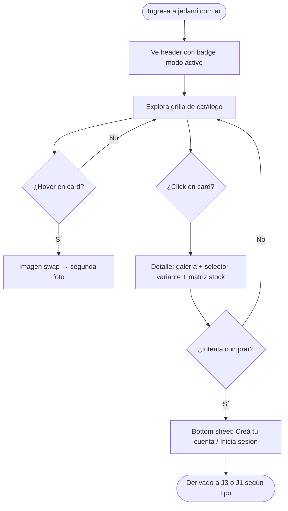
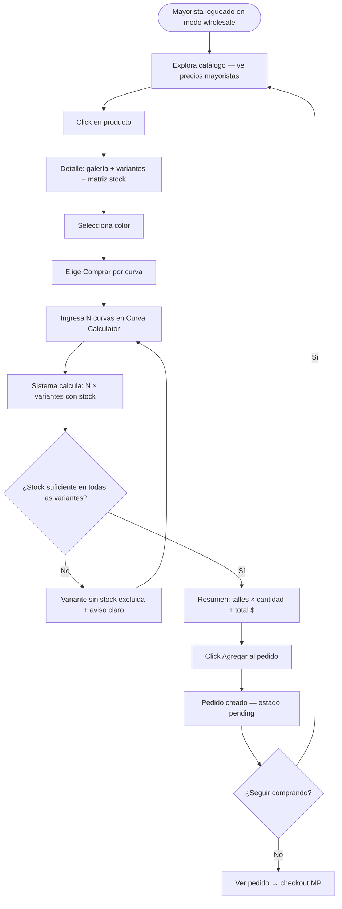
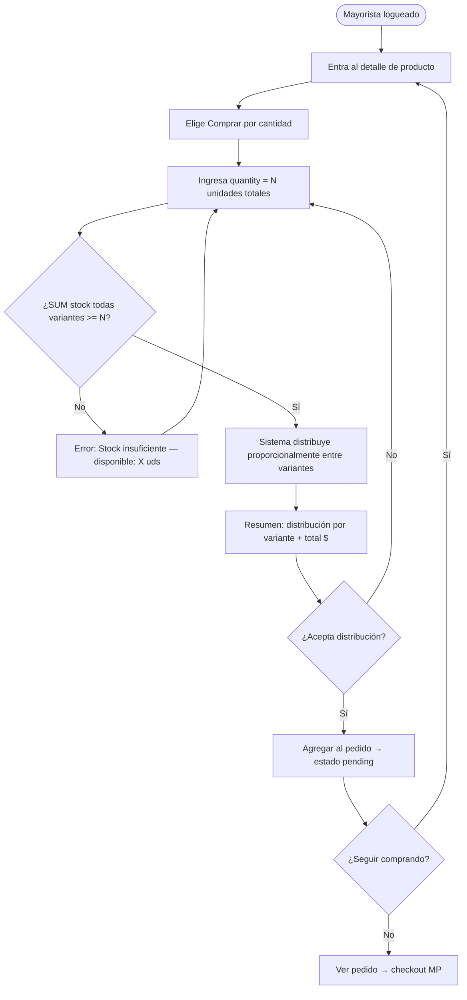
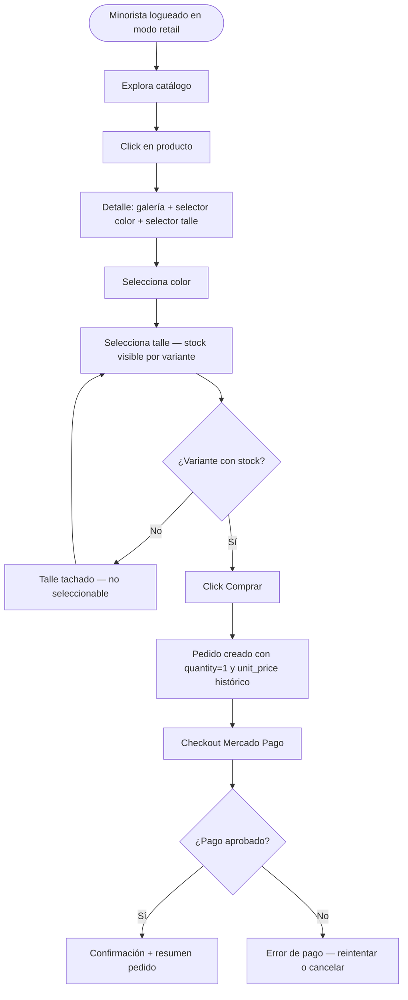
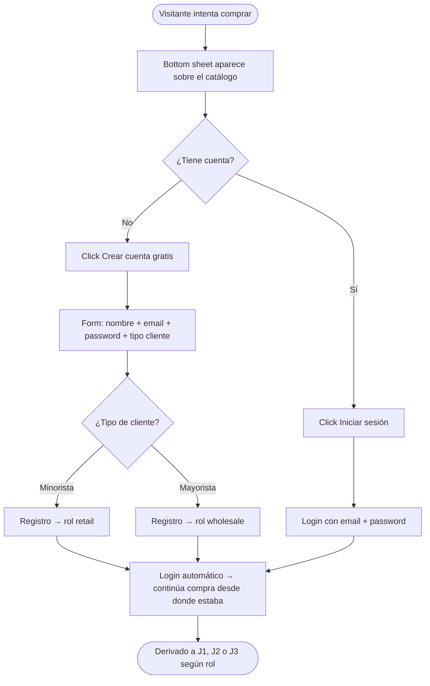

# UX Design Specification tienda-jedami

**Author:** Marceloo
**Date:** 2026-03-10

---

<!-- UX design content will be appended sequentially through collaborative workflow steps -->

## Executive Summary

### Project Vision

tienda-jedami es una plataforma de venta online con doble modalidad de operación (minorista y mayorista) que permite a cualquier visitante explorar el catálogo libremente y a usuarios registrados comprar según su tipo de cliente. El diferenciador central es la gestión de compras mayoristas en dos modalidades únicas de la industria textil: por curva (una unidad de cada variante del producto) y por cantidad (volumen total con distribución automática entre variantes).

### Target Users

- **Visitante**: Explora sin registrarse. Precio y disponibilidad visible según modo activo de la tienda.
- **Cliente Minorista**: Compra individual por variante (talle + color). Flujo simple y directo.
- **Cliente Mayorista**: Compra en volumen con dos modalidades específicas (curva / cantidad).
- **Administrador**: Gestiona catálogo completo, variantes, stock y usuarios del sistema.

### Key Design Challenges

- **D1**: Comunicación clara del modo activo de la tienda (retail vs. wholesale) — el visitante debe saber en qué contexto está mirando precios
- **D2**: Selector de variantes (talle + color) con estado de stock visible en tiempo real
- **D3**: Concepto de "curva" intuitivo y calculable para el mayorista — vocabulario de industria que necesita traducción UX
- **D4**: Dos flujos de pedido radicalmente distintos (minorista vs. mayorista) coexistiendo en la misma interfaz
- **D5**: Registro sin fricción — invitación contextual en el momento de compra, no una pared

### Design Opportunities

- **O1**: Mode switcher que transforma el contexto visual y el lenguaje de la tienda (retail ↔ wholesale)
- **O2**: Grilla de variantes con indicadores visuales de stock (disponible / bajo / agotado)
- **O3**: Curva calculator — resumen visual del pedido mayorista antes de confirmar
- **O4**: Gate de registro suave (bottom sheet / modal contextual) en el momento de compra

---

## Core Experience Definition

### Defining Experience

La acción central que define tienda-jedami es la **exploración del catálogo**. Tanto el visitante ocasional como el mayorista profesional inician su relación con la plataforma mirando productos. El catálogo no es un paso previo a la compra — *es* el producto.

La segunda acción definitoria es la **selección de variante** (talle + color): el momento en que el usuario pasa de explorar a comprometerse. Este selector debe comunicar disponibilidad real de stock y ser trivialmente fácil de operar.

### Platform Strategy

| Segmento | Plataforma primaria | Justificación |
|---|---|---|
| Mayorista | Web (desktop-first) | Opera en volumen, necesita pantalla grande para curva calculator y grillas de variantes |
| Minorista | Web (responsive) | Compra individual, puede llegar desde móvil o desktop |
| Visitante | Web (responsive) | Exploración libre, cualquier dispositivo |
| Administrador | Web + Mobile Flutter | Necesita gestión full en escritorio Y movilidad para control de stock en depósito |

**Conclusión de plataforma:** Web-first. El mobile Flutter existe exclusivamente para el flujo de administración.

### Effortless Interactions

Las interacciones que deben sentirse sin fricción:

1. **Exploración del catálogo** — scroll infinito o paginación suave; filtros visibles sin colapsar; precio siempre visible sin hover
2. **Selector de variante (2 pasos)** — primero color, luego talle; stock comunicado visualmente por color de estado (disponible / bajo / agotado)
3. **Pedido repetido (mayorista)** — "Repetir pedido anterior" como acción de primer nivel en la interfaz mayorista; ahorra tiempo en el flujo de compra en volumen
4. **Velocidad del catálogo en modo mayorista** — carga rápida de precios mayoristas y disponibilidad; sin spinners que interrumpan el flujo de navegación

### Critical Success Moments

| ID | Momento | Importancia | Por qué |
|---|---|---|---|
| **M1** | Indicador de modo siempre visible | ★★★★★ CRÍTICO | El mayor riesgo de confusión: ¿estoy viendo precios retail o wholesale? Si falla esto, todo lo demás falla |
| **M2** | Primera vista del catálogo | ★★★★☆ | Primera impresión — debe comunicar calidad, variedad y el modo activo |
| **M3** | Selección de variante | ★★★★☆ | Momento de decisión; el stock debe ser claro y la selección fluida |
| **M4** | Confirmación de pedido | ★★★☆☆ | Cierre del flujo; resumen claro con precios y cantidades antes de pagar |

### Experience Principles

- **EP1 — Modo siempre visible**: El indicador retail/wholesale nunca desaparece durante la sesión. Sin ambigüedad de contexto.
- **EP2 — El catálogo es el producto**: La navegación del catálogo es rápida, visual y sin fricción. El resto del flujo sirve al catálogo.
- **EP3 — El stock es la verdad**: Los estados de stock (disponible/bajo/agotado) se muestran en tiempo real y nunca se ocultan. Sin sorpresas al confirmar.
- **EP4 — Registro suave, no muro**: El registro se invita en el momento de compra con un modal contextual, no como prerequisito de navegación.
- **EP5 — El mayorista ahorra tiempo**: Flujos de compra en volumen diseñados para eficiencia repetitiva, no para primera vez. Repeat order como feature de primer nivel.

---

## Desired Emotional Response

### Primary Emotional Goals

| Usuario | Emoción objetivo | Anti-emoción (evitar) |
|---|---|---|
| **Visitante** | Curioso, bienvenido | Perdido, excluido |
| **Minorista** | Confiado, tranquilo | Ansioso, confundido |
| **Mayorista** | Eficiente, en control | Frustrado, inseguro del precio |
| **Administrador** | Organizado, capaz | Abrumado, con miedo a romper algo |

### Emotional Journey Mapping

| Etapa | Emoción esperada |
|---|---|
| Primera llegada al catálogo | Interés, claridad — "sé dónde estoy y qué veo" |
| Exploración de producto | Confianza visual, curiosidad por variantes |
| Selección de variante (talle+color) | Control, claridad de stock en tiempo real |
| Gate de registro (invitación a comprar) | Bienvenida, sin presión |
| Confirmación del pedido | Alivio, certeza — "sé exactamente lo que estoy comprando" |
| Error / problema (ej: stock insuficiente) | Información sin drama — "entiendo qué pasó y cómo resolverlo" |
| Retorno (mayorista repite pedido) | Eficiencia, familiaridad — "la plataforma me conoce" |

### Micro-Emotions

- **Confianza vs. Escepticismo** → El precio que veo es el precio que pago. Sin sorpresas.
- **Control vs. Confusión** → El modo (retail/wholesale) siempre claro. Sé en qué contexto estoy.
- **Eficiencia vs. Frustración** → El mayorista no quiere aprender un sistema nuevo cada vez. Flujo predecible.
- **Delight vs. Indiferencia** → El curva calculator es el momento de deleite del mayorista — resumen visual antes de confirmar.

### Design Implications

| Emoción buscada | Decisión UX que la genera |
|---|---|
| Confianza en precios | Precio siempre visible en la card, sin hover; precio confirmado en checkout |
| Control de contexto | Mode switcher en header persistente con cambio visual claro (color/label) |
| Eficiencia del mayorista | "Repetir pedido" como CTA prominente; curva calculator con totales inmediatos |
| Bienvenida sin presión | Modal de registro contextual (bottom sheet) solo al intentar comprar, nunca al navegar |
| Claridad de stock | Indicadores por variante: disponible / bajo / agotado (verde/amarillo/rojo) |
| Certeza al confirmar | Resumen detallado antes del pago: variantes, cantidades, precios, total |

### Emotional Design Principles

- **Nunca dejés al usuario sin contexto**: Todo estado del sistema (modo activo, stock, precio) debe ser visible sin acción extra.
- **Los errores son información, no culpa**: Mensajes de error claros y accionables, sin drama. "Stock insuficiente en talle M — disponibles: 3" es mejor que "Error 422".
- **La eficiencia es respeto**: Para el mayorista profesional, cada click ahorrado es señal de que la plataforma lo entiende.
- **El deleite es el curva calculator**: El único momento de "wow" esperado — ver el resumen de un pedido mayorista complejo calculado automáticamente.

---

## UX Pattern Analysis & Inspiration

### Inspiring Products Analysis

**1. modatex.com.ar / Black Olive — Catálogo**
- Grid limpio con swatches de color inline en la card
- Lazy loading con animación de brand — percepción de velocidad
- Badges contextuales (2x1, Sin stock) sin saturar la card
- Filtros por categoría visibles y directos
- **Patrón clave:** stock como estado de la card, no escondido hasta el detalle

**2. coleccionabril.com.ar — Catálogo "Lo nuevo"**
- **Hover image swap**: al pasar el mouse, la imagen cambia a otra vista del producto
- Swatches de color clickeables directamente desde la grilla
- Quick view (Vista rápida) — modal liviano sin salir del catálogo
- Filtros laterales con color, talle y tela — específico para textil
- **Patrón clave:** acción desde la grilla — el usuario decide antes de entrar al detalle

**3. coleccionabril.com.ar — Detalle de producto**
- Galería de imágenes con thumbnails navegables — múltiples ángulos del producto
- Selector talle + color con **matriz de stock visible** (dash = sin stock, número = disponible)
- Precio sin IVA explícito — relevante para mayoristas
- Selector de cantidad con total calculado en tiempo real
- **Patrón clave:** matriz de stock como verdad del sistema

**4. MercadoLibre — Detalle y carrito**
- Información densa pero escaneable — jerarquía tipográfica clara
- Carrito con resumen visual: imagen + nombre + variante + cantidad + precio unitario + total
- **Patrón clave:** carrito como resumen de decisión, no solo lista de items

### Transferable UX Patterns

| Patrón | Origen | Aplicación en jedami |
|---|---|---|
| **Hover image swap** | Colección Abril catálogo | Al pasar el mouse por una card, mostrar foto alternativa del producto |
| **Swatches de color en la card** | Modatex + Colección Abril | Color selector desde la grilla; al clickear pre-selecciona en el detalle |
| **Matriz de stock talle×color** | Colección Abril detalle | En el detalle, tabla visual con disponibilidad por combinación de variante |
| **Total en tiempo real** | Colección Abril detalle | En el selector de cantidad, calcular y mostrar total mientras el usuario tipea |
| **Quick view** | Colección Abril | Modal liviano desde la grilla; en modo mayorista puede mostrar curva calculator |
| **Carrito con resumen visual** | MercadoLibre | En checkout mayorista: imagen + variante + cantidad + precio por item |
| **Badge de stock en card** | Modatex | "Sin stock" / "Últimas unidades" directo en grilla, sin entrar al detalle |

### Anti-Patterns to Avoid

Referencia: **americabebes.com.ar**

| Anti-patrón | Impacto |
|---|---|
| Fondo blanco liso sin jerarquía visual | Todo se ve igual, sin peso ni foco |
| Cards idénticas sin diferenciación | Catálogo parece depósito, no tienda |
| Banners estáticos sin energía | Primera impresión sin enganche emocional |
| CTAs sin prominencia visual | El usuario no sabe dónde hacer clic |
| Fotografía utilitaria sin aspiración | No genera deseo de compra |
| Paleta apagada sin acento de color claro | Sin personalidad de marca |

### Design Inspiration Strategy

**Adoptar directamente:**
- Hover image swap — low cost, alto impacto de percepción
- Swatches de color en grilla — reduce clicks hacia el detalle
- Matriz talle×color con disponibilidad — vital para el mayorista

**Adaptar:**
- Quick view → en modo mayorista muestra el curva calculator directamente
- Total en tiempo real → para curva: "X curvas = Y unidades totales = $Z"
- Carrito ML → adaptar para pedidos mayoristas con purchase_type visible

**Evitar:**
- Fondos blancos lisos sin jerarquía — definir tono base de fondo con respiración
- Cards idénticas sin personalidad — usar el modo activo para diferenciar visualmente
- CTAs sin peso visual — el botón principal debe ser el elemento de más peso en pantalla

---

## Design System Foundation

### Design System Choice

**shadcn-vue + Tailwind CSS** (Opción A — Themeable/Headless)

Para `jedami-web` (Vue 3 + Vite): componentes headless de shadcn-vue con Tailwind CSS como sistema de tokens de diseño.
Para `jedami-mobile` (Flutter admin): Material 3 con tema personalizado, sistema independiente del web.

### Rationale for Selection

- **Ya definido en la arquitectura**: shadcn-vue estaba en el stack desde el origen; no introduce tecnología nueva
- **Control visual total**: los componentes son código copiado al repositorio — sin librería que pelee contra el estilo propio
- **Tailwind como design tokens**: los modos retail/wholesale se implementan con CSS variables (`--color-mode-accent`, `--color-mode-bg`) que cambian en el mode switch
- **Headless por naturaleza**: shadcn-vue define behavior (accesibilidad, foco, keyboard nav) pero no fuerza estilos — permite lograr el look de Colección Abril sin sobreescribir estilos de terceros
- **Flutter Material 3 independiente**: el admin mobile tiene su propio sistema coherente con las plataformas nativas

### Implementation Approach

- **Design tokens vía CSS variables de Tailwind**: paleta de color, tipografía y espaciado definidos en `tailwind.config.ts`
- **Modo retail/wholesale como variable CSS**: `data-mode="retail"` / `data-mode="wholesale"` en el `<html>` para cambiar acento de color y labels de forma global
- **Componentes shadcn-vue**: Button, Card, Dialog, Sheet, Badge, Select, Table — copiados al repo y adaptados al brand
- **Componentes custom**: `VariantMatrix`, `CurvaCalculator`, `ModeIndicator` — construidos sobre los primitivos de shadcn-vue

### Customization Strategy

| Token | Retail | Wholesale |
|---|---|---|
| `--accent` | Color cálido (ej: rosa/coral) | Color frío profesional (ej: índigo/azul oscuro) |
| `--label-price` | "Precio" | "Precio mayorista" |
| `--label-cta` | "Comprar" | "Agregar al pedido" |
| Fondo de header | Neutro claro | Tono oscuro/profundo |

Los componentes reutilizables custom del dominio (`VariantMatrix`, `ModeIndicator`, `CurvaCalculator`, `StockBadge`) se documentan en Storybook o como stories locales.

---

## 2. Core User Experience

### 2.1 Defining Experience

> **"Ver el producto, entender el stock, y comprarlo en el modo correcto."**

La secuencia central que define tienda-jedami:

1. **Ver** — explorar el catálogo con contexto claro (modo activo visible, precio visible en la card)
2. **Entender** — seleccionar la variante (talle + color) y ver el stock en tiempo real
3. **Comprar** — iniciar el pedido en el flujo correcto (retail → cantidad, wholesale → curva o cantidad)

Si los tres pasos fluyen sin ambigüedad, el producto cumple su promesa.

### 2.2 User Mental Model

| Usuario | Cómo llega | Qué espera | Dónde se confunde hoy |
|---|---|---|---|
| **Mayorista** | Ya conoce el producto, viene a repetir o explorar novedades | Ver precios mayoristas directo, sin pasos extra | ¿Los precios que veo son mis precios? ¿Cuánto stock total hay? |
| **Minorista** | Llega a buscar algo específico o explorar | Ver precio, talle disponible, confirmar y pagar | No sabe si el talle que quiere tiene stock sin entrar al detalle |
| **Visitante** | Exploración sin intención de compra inmediata | Ver qué hay, qué sale | No sabe en qué "modo" está la tienda ni si los precios le aplican |

### 2.3 Success Criteria

- ✅ El modo activo (retail/wholesale) es visible **antes** de ver el primer precio
- ✅ El stock de cada variante es visible **en la grilla** sin entrar al detalle
- ✅ Seleccionar talle + color toma **máximo 2 clicks**
- ✅ El mayorista puede iniciar un pedido por curva con **menos de 5 acciones** desde la card del producto
- ✅ El gate de registro aparece **solo cuando el usuario intenta comprar**, nunca antes
- ✅ El carrito/resumen de pedido refleja el tipo de compra elegido (curva / cantidad / unitario)

### 2.4 Novel UX Patterns

| Interacción | Tipo | Patrón base |
|---|---|---|
| Selector de variante (talle + color) | Establecido | Grilla de swatches — patrón estándar e-commerce |
| Mode indicator retail/wholesale | **Novel** (para este dominio) | Badge persistente en header + cambio visual de acento de color |
| Curva calculator | **Novel** | Input "N curvas" → tabla de unidades por variante + total calculado |
| Compra por cantidad con distribución automática | **Novel** | Input `{ productId, quantity }` → sistema distribuye; resumen antes de confirmar |
| Repeat order (mayorista) | Semi-novel | "Repetir último pedido" como CTA — patrón conocido en food delivery, nuevo en textil |
| Soft registration gate | Establecido | Bottom sheet / modal en momento de compra — patrón de ML, Rappi |

### 2.5 Experience Mechanics — Flujo central: Mayorista compra por curva

**1. Initiation** — El mayorista llega al catálogo en modo wholesale (badge visible en header). Ve una card de producto con hover image swap y badge de disponibilidad.

**2. Interaction** — Hace click en la card. Entra al detalle: galería de fotos + selector de color + selector de talle con matriz de stock. Elige "Comprar por curva". Ingresa N = 3 curvas.

**3. Feedback** — El curva calculator muestra en tiempo real: talle 2: 3 uds, talle 3: 3 uds, … total: 15 uds, precio total: $X. Stock validado visualmente (verde por variante disponible).

**4. Completion** — Click en "Agregar al pedido". Si no está logueado → bottom sheet de registro/login contextual. Pedido agregado → confirmación con resumen. Disponible "Seguir comprando" o "Ver pedido".

---

## Visual Design Foundation

### Color System

Extraído del logo JEDAMI (ropa de bebé y niños/as):

| Token | Color | Hex | Uso |
|---|---|---|---|
| `--brand-primary` | Magenta/Rosa | `#E91E8C` | CTA principal, botones de compra |
| `--brand-secondary` | Turquesa | `#00BCD4` | Acento secundario, badges, hover |
| `--brand-tertiary` | Verde | `#4CAF50` | Estados positivos (stock disponible) |
| `--brand-warning` | Naranja | `#FF9800` | Stock bajo / alertas |
| `--brand-error` | Rojo | `#F44336` | Sin stock / errores |
| `--brand-info` | Azul | `#1565C0` | Información, links |
| `--bg-base` | Celeste muy claro | `#F0F8FF` | Fondo base de la app |
| `--bg-card` | Blanco | `#FFFFFF` | Cards de producto |

**Modo retail** → acento `--brand-primary` (magenta cálido, familiar)
**Modo wholesale** → acento `--brand-info` (azul profesional)

### Typography System

**Fuente principal: Nunito** (Google Fonts, libre)
Rounded, amigable, legible — coherente con la identidad de marca infantil sin ser infantiloide en la UI.

| Escala | Uso | Tamaño | Peso |
|---|---|---|---|
| `text-4xl` | Hero / nombre de marca | 36px | 800 ExtraBold |
| `text-2xl` | Título de producto | 24px | 700 Bold |
| `text-xl` | Precio destacado | 20px | 700 Bold |
| `text-base` | Body / descripción | 16px | 400 Regular |
| `text-sm` | Labels, badges, stock | 14px | 600 SemiBold |
| `text-xs` | Metadata, SKU | 12px | 400 Regular |

### Spacing & Layout Foundation

- **Base unit**: 4px (escala Tailwind estándar)
- **Grid catálogo**: 4 columnas desktop / 2 tablet / 1 mobile
- **Gap entre cards**: `gap-6` (24px) — layout aireado
- **Aspect ratio de imágenes**: `3/4` portrait — estándar para ropa de niños
- **Border radius**: `rounded-2xl` (16px) en cards — refuerza calidez y redondez del brand

### Accessibility Considerations

- Contraste `#E91E8C` sobre blanco → 4.6:1 ✅ WCAG AA
- Contraste `#1565C0` sobre blanco → 8.5:1 ✅ WCAG AAA
- Tamaño mínimo body: 16px
- Stock badges: siempre texto + color, nunca solo color
- Focus rings visibles (shadcn-vue los provee por defecto)

---

## Design Direction Decision

### Design Directions Explored

Se exploraron 8 direcciones visuales (ver `ux-design-directions.html`):

1. **Playful Rainbow** — catálogo retail, fondo rosado, badges de stock, pills de filtro
2. **Clean Professional** — catálogo wholesale adulto, fondo blanco, acento azul
3. **Dark Premium** — catálogo oscuro navy + magenta
4. **Soft Pastel** — catálogo crema cálido, ribbons, talles en card
5. **Mode Switch Demo** — retail vs wholesale lado a lado
6. **Product Detail** — selector de variantes + matriz de stock
7. **Curva Calculator** — cálculo interactivo en tiempo real
8. **Registration Gate** — bottom sheet de invitación contextual

### Chosen Direction

**Soft Pastel + Estructura Dirección 1 + Mode badge sutil**

- **Layout y estructura**: Dirección 1 — grid con pills de filtro, badges de stock, swatches en card, bordes redondeados
- **Mood visual**: Dirección 4 Soft Pastel — fondo crema cálido, gradiente magenta-naranja, coherente con la identidad JEDAMI bebé/niños
- **Contexto mayorista bebé**: misma paleta + badge "Mayorista" en header + labels diferenciados
- **Contexto mayorista adulto** (futuro): acento azul profesional (Dirección 2) como variante de tema opcional

### Design Rationale

- Soft Pastel (crema + magenta) es coherente con el logo JEDAMI (arcoiris, colores cálidos)
- La estructura de Dirección 1 expone el stock en la grilla sin requerir entrar al detalle
- El mode switch **no cambia el estilo visual drásticamente** — solo el badge en header, labels de precio y texto de CTA. El usuario nota el cambio de contexto sin desorientarse visualmente

### Implementation Approach

- CSS variable `data-mode="retail|wholesale"` en `<html>` para cambiar badge, labels y CTA globalmente
- Hover image swap en cards de catálogo (swap de `src` al mouseover)
- Ribbons "NUEVO" para productos recientes (flag en API response)
- Talles disponibles visibles en la card (variantes con stock > 0)

---

## User Journey Flows

### J0 — Visitante explora catálogo (sin registro)

### J1 — Mayorista compra por curva

### J2 — Mayorista compra por cantidad

### J3 — Minorista compra individual

### J4 — Gate de registro suave

### Journey Patterns

| Patrón | Descripción | Aplicado en |
|---|---|---|
| **Contexto persistente** | El modo activo nunca desaparece durante el journey | Todos |
| **Stock como gate visual** | Variantes sin stock deshabilitadas visualmente antes de intentar agregar | J1, J3 |
| **Confirmación antes de compromiso** | Resumen del pedido visible antes del click final | J1, J2 |
| **Soft gate de registro** | El registro aparece solo cuando el usuario intenta algo que lo requiere | J4 |
| **Continuidad post-registro** | Después del login, el usuario vuelve exactamente donde estaba | J4 |
| **Errores informativos** | Mensajes de error incluyen el dato accionable (stock disponible: X) | J1, J2, J3 |

### Flow Optimization Principles

- **Mínimo 5 acciones** para completar una compra mayorista por curva desde el catálogo
- **Cero interrupciones** durante la exploración del catálogo (el registro nunca bloquea navegación)
- **Feedback inmediato** en el Curva Calculator — el total se actualiza en tiempo real al tipear
- **Recuperación grácil** de errores de stock — el sistema muestra cuánto hay disponible, no solo "error"

---

## Component Strategy

### Design System Components

Componentes de shadcn-vue utilizados sin modificación estructural:

| Componente | Uso en JEDAMI |
|---|---|
| `Button` | CTA primario/secundario: "Comprar", "Agregar al pedido", "Ver pedido" |
| `Card` | Base estructural de la product card del catálogo |
| `Dialog` | Quick view de producto desde la grilla |
| `Sheet` | Bottom sheet del soft registration gate |
| `Badge` | Stock indicator, mode badge, ribbon "NUEVO" |
| `Select` | Selector de talle y color (fallback accesible para mobile) |
| `Input` | Input de curvas, campos de formulario de registro |
| `Table` | Matriz de stock talle×color |
| `Toast` | Confirmación "Producto agregado al pedido" |
| `Avatar` | Foto/inicial del usuario en header |
| `Separator` | Divisores en detalle de producto |

### Custom Components

**`<ProductCard>`**
- **Propósito**: Card del catálogo con hover image swap, swatches de color, badge de stock y talles disponibles
- **Estados**: default, hover (imagen swap), agotado (opacidad reducida + badge "Sin stock")
- **Props**: `product`, `mode` (retail/wholesale), `onQuickView`
- **Anatomy**: imagen principal + imagen hover, nombre, precio con label según mode, swatches, stock badge, talles disponibles

**`<VariantSelector>`**
- **Propósito**: Selector de color + talle en el detalle del producto, con stock comunicado visualmente
- **Estados**: color-seleccionado, talle-disponible, talle-sin-stock (tachado, `aria-disabled`)
- **Props**: `variants[]`, `selectedColor`, `selectedSize`, `onSelect`
- **Anatomy**: grilla de swatches de color + grilla de botones de talle + contador "X disponibles"

**`<StockMatrix>`**
- **Propósito**: Tabla talle×color con cantidad de stock por celda — la verdad del sistema visible
- **Estados por celda**: disponible (verde, >3), bajo (amarillo, 1–3), agotado (rojo, 0)
- **Props**: `variants[]`, `highlightColor`
- **Anatomy**: tabla con headers de talle y color, celdas coloreadas, leyenda de estados

**`<CurvaCalculator>`**
- **Propósito**: Input de N curvas → cálculo en tiempo real de unidades por variante y total $
- **Estados**: válido, advertencia (variante excluida por stock insuficiente), inválido (N=0)
- **Props**: `product`, `selectedColor`, `pricePerUnit`, `onAdd`
- **Anatomy**: input numérico de curvas, grilla resultado por talle, total unidades + total precio, CTA

**`<ModeIndicator>`**
- **Propósito**: Badge persistente en el header que comunica el modo activo sin ambigüedad
- **Estados**: `retail` (magenta, "🛍️ Minorista"), `wholesale` (azul, "🏭 Mayorista")
- **Props**: `mode`
- **Accessibility**: `aria-label="Modo de compra activo: Minorista"` (o Mayorista)

### Component Implementation Strategy

- Todos los custom components se construyen sobre los primitivos de shadcn-vue (behavior + a11y garantizados)
- Design tokens de Tailwind (`--brand-primary`, `--brand-info`) usados en los custom components para heredar el modo activo
- Cada componente custom tiene su propio archivo en `jedami-web/src/components/catalog/`

### Implementation Roadmap

| Fase | Componentes a desarrollar |
|---|---|
| **Épica 1** — Catálogo público | `ProductCard`, `ModeIndicator`, `VariantSelector`, `StockMatrix` |
| **Épica 2** — Compra mayorista | `CurvaCalculator`, `Sheet` (gate registro) |
| **Épica 3** — Pagos | Sin componentes custom nuevos — integración MP en flujo existente |
| **Épica 4** — Compra minorista | Reutiliza `VariantSelector` + `ProductCard` ya construidos |

---

## UX Consistency Patterns

### Button Hierarchy

| Nivel | Apariencia | Uso |
|---|---|---|
| **Primary** | Fondo `--brand-primary` (magenta), texto blanco, `rounded-2xl` | Una sola acción por pantalla: "Comprar", "Agregar al pedido", "Crear cuenta" |
| **Secondary** | Borde `--brand-primary`, fondo transparente, texto magenta | Acción alternativa: "Ver pedido", "Ver más fotos", "Iniciar sesión" |
| **Ghost** | Sin borde, texto `--brand-primary` | Acciones terciarias: "Cancelar", "Volver al catálogo" |
| **Destructive** | Fondo `--brand-error` (rojo) | Solo acciones irreversibles: "Cancelar pedido" |
| **Disabled** | Opacidad 40%, cursor not-allowed | Variante sin stock, form inválido |

**Regla invariable**: nunca dos botones Primary en la misma vista.

### Feedback Patterns

| Situación | Patrón | Componente |
|---|---|---|
| Acción exitosa (agregar al pedido) | Toast verde, 3s auto-dismiss, ícono ✓ | `Toast` shadcn-vue |
| Error de stock insuficiente | Inline bajo el selector, texto rojo + cantidad disponible | Mensaje inline |
| Error de pago MP | Modal con opciones: reintentar / cambiar método / cancelar | `Dialog` |
| Carga de catálogo | Skeleton cards animadas — nunca spinner bloqueante de página | Skeleton CSS |
| Sin resultados de filtro | Ilustración + mensaje + CTA "Limpiar filtros" | Empty state |

### Form Patterns

| Patrón | Regla |
|---|---|
| **Validación** | On-blur (al salir del campo), no on-change — menos interrupción |
| **Errores** | Bajo el campo, texto rojo `text-sm`, ícono ✗ — nunca solo color |
| **Campos requeridos** | Marcados con `*`, descripción al inicio del form |
| **Password** | Siempre con toggle de visibilidad |
| **Submit** | Botón Primary deshabilitado hasta form válido |
| **Loading state** | Spinner inline en el botón al enviar — no reemplazar con spinner de página |

### Navigation Patterns

| Patrón | Implementación |
|---|---|
| **Header persistente** | Fijo en scroll — logo + mode indicator + carrito siempre visibles |
| **Breadcrumb** | Solo en detalle de producto: `Inicio > Categoría > Producto` |
| **Back en mobile** | Flecha ← para volver al catálogo desde el detalle |
| **Filtros** | Pills horizontales en mobile / sidebar en desktop, siempre visibles por defecto |
| **Paginación** | "Cargar más" (load more) — no paginación numérica |

### Additional Patterns

**Modal & Overlays:**
- Quick view → `Dialog` centrado, máx 600px, cierre con Esc o click fuera
- Registration gate → `Sheet` desde abajo (bottom) — menos invasivo que Dialog
- Confirmación de pedido → `Dialog` con resumen completo antes del checkout
- Loading → nunca bloquear toda la pantalla — loader solo en el elemento que carga

**Empty States:**
- Catálogo sin resultados: ilustración amigable (coherente con branding infantil) + mensaje en primera persona + CTA
- Pedido vacío: "Todavía no agregaste productos" + CTA al catálogo
- Sin historial de pedidos: "Hacé tu primer pedido" + CTA al catálogo

---

## Responsive Design & Accessibility

### Responsive Strategy

| Dispositivo | Estrategia | Audiencia principal |
|---|---|---|
| **Desktop (1024px+)** | 4 cols catálogo, sidebar filtros fijo, curva calculator inline | Mayorista profesional |
| **Tablet (768–1023px)** | 2–3 cols catálogo, filtros colapsables, touch-optimized | Minorista + Mayorista casual |
| **Mobile (< 768px)** | 1–2 cols catálogo, bottom nav, sheet para filtros, curva calculator full-screen | Minorista + Visitante |
| **Flutter admin (mobile)** | Sistema independiente — Material 3, gestión de catálogo y stock | Administrador |

### Breakpoint Strategy

| Nombre Tailwind | Breakpoint | Columnas catálogo |
|---|---|---|
| default (mobile) | < 640px | 2 columnas |
| `sm` | 640px | 2 columnas |
| `md` | 768px | 3 columnas + sidebar |
| `lg` | 1024px | 4 columnas + sidebar fijo |
| `xl` | 1280px | 4 columnas + más espacio lateral |

**Filosofía**: desktop-first en el diseño (mayorista es el usuario primario), CSS escrito mobile-first (buena práctica técnica con Tailwind).

### Accessibility Strategy

**Nivel objetivo: WCAG 2.1 AA**

| Área | Regla | Cobertura |
|---|---|---|
| **Contraste de color** | ≥ 4.5:1 texto normal, ≥ 3:1 texto grande | ✅ Paleta validada |
| **Touch targets** | Mínimo 44×44px en todos los interactivos | Implementar en componentes |
| **Navegación por teclado** | Tab/Enter/Esc en todos los interactivos | shadcn-vue lo provee |
| **Focus indicators** | Visible, contraste ≥ 3:1 sobre el fondo | shadcn-vue lo provee |
| **ARIA labels** | En todos los interactivos sin texto visible | Definido en componentes custom |
| **Alt text imágenes** | Descriptivo: "Vestido floral - Rosa - Talle 3" | Dato del API response |
| **Stock por color** | Texto + color siempre — nunca solo color | Definido en `StockMatrix` |
| **Errores de form** | Asociados al campo con `aria-describedby` | shadcn-vue Form |

### Testing Strategy

**Responsive:**
- Chrome DevTools device emulation (desarrollo diario)
- Test real en Android + iPad antes de cada release
- Browsers: Chrome, Firefox, Safari, Edge

**Accessibility:**
- `axe-core` integrado en pipeline CI (automatizado)
- Navegación manual con Tab en flujos críticos J1, J3, J4
- VoiceOver macOS/iOS para flujo de compra antes de cada release

### Implementation Guidelines

- Unidades relativas (`rem`, `%`, `vw/vh`) sobre px fijos
- Imágenes con `loading="lazy"` y dimensiones explícitas para evitar layout shift
- CSS variables para tokens de modo (`--mode-accent`, `--mode-label`) — sin duplicar estilos
- Componentes shadcn-vue no modificar internamente — extender con clases Tailwind vía `class` prop
- `axe-core` como devDependency — correr en tests de componentes

