# Diagrama Entidad-Relación — tienda-jedami

> Schema final post-migración `017_variants_refactor`. Última actualización: 2026-03-14.

## DER Completo

```mermaid
erDiagram

  %% ─── AUTH ────────────────────────────────────────────────────────────────

  roles {
    serial   id PK
    varchar  name UK "NOT NULL"
  }

  users {
    serial    id PK
    varchar   email UK "NOT NULL"
    text      password_hash "NOT NULL"
    timestamp created_at "DEFAULT NOW()"
  }

  user_roles {
    int user_id PK,FK
    int role_id PK,FK
  }

  refresh_tokens {
    serial      id PK
    int         user_id FK "NOT NULL"
    varchar_64  token_hash UK "NOT NULL"
    timestamptz expires_at "NOT NULL"
    timestamptz revoked_at "nullable"
    timestamptz created_at "DEFAULT NOW()"
  }

  %% ─── CUSTOMERS & ORDERS ──────────────────────────────────────────────────

  customers {
    serial  id PK
    int     user_id FK "UNIQUE NOT NULL"
    varchar customer_type "retail | wholesale"
  }

  orders {
    serial      id PK
    int         customer_id FK "NOT NULL"
    varchar     purchase_type "curva | cantidad | retail"
    varchar     status "pending | paid | rejected"
    numeric     total_amount "DEFAULT 0"
    timestamptz created_at "DEFAULT NOW()"
  }

  order_items {
    serial  id PK
    int     order_id FK "NOT NULL"
    int     variant_id FK "nullable"
    int     product_id FK "nullable"
    int     quantity "CHECK > 0"
    numeric unit_price "NOT NULL"
  }

  payments {
    serial      id PK
    int         order_id FK "NOT NULL"
    varchar     mp_preference_id "nullable"
    varchar     mp_payment_id "nullable"
    varchar     status "pending | approved | rejected"
    numeric     amount "nullable"
    timestamptz paid_at "nullable"
    timestamptz created_at "DEFAULT NOW()"
  }

  %% ─── TABLAS DE REFERENCIA ────────────────────────────────────────────────

  categories {
    serial      id PK
    varchar     name UK "NOT NULL"
    varchar     slug UK "NOT NULL"
    timestamptz created_at "DEFAULT NOW()"
  }

  sizes {
    serial  id PK
    varchar label UK "NOT NULL"
    int     sort_order "DEFAULT 0"
  }

  colors {
    serial  id PK
    varchar name UK "NOT NULL"
    varchar hex_code "nullable — ej: #FFFFFF"
  }

  price_modes {
    serial  id PK
    varchar code UK "retail | wholesale"
    varchar label "Minorista | Mayorista"
  }

  %% ─── PRODUCTOS ───────────────────────────────────────────────────────────

  products {
    serial  id PK
    varchar name "NOT NULL"
    text    description "nullable"
    int     category_id FK "nullable"
  }

  product_images {
    serial      id PK
    int         product_id FK "NOT NULL"
    text        url "NOT NULL"
    int         position "DEFAULT 0"
    timestamptz created_at "DEFAULT NOW()"
  }

  product_prices {
    int     product_id PK,FK "NOT NULL"
    int     price_mode_id PK,FK "NOT NULL"
    numeric price "NOT NULL CHECK >= 0"
  }

  variants {
    serial id PK
    int    product_id FK "NOT NULL"
    int    size_id FK "NOT NULL"
    int    color_id FK "NOT NULL"
  }

  stock {
    int variant_id PK,FK "NOT NULL"
    int quantity "DEFAULT 0 CHECK >= 0"
  }

  %% ─── RELACIONES ──────────────────────────────────────────────────────────

  users          ||--o{ user_roles        : "tiene roles"
  roles          ||--o{ user_roles        : "asignado a"
  users          ||--o{ refresh_tokens    : "posee"
  users          ||--o| customers         : "es cliente"

  customers      ||--o{ orders            : "realiza"
  orders         ||--o{ order_items       : "contiene"
  orders         ||--o{ payments          : "tiene pago"

  variants       ||--o{ order_items       : "referenciado en"
  products       ||--o{ order_items       : "referenciado en"

  categories     ||--o{ products          : "clasifica"
  products       ||--o{ product_images    : "tiene fotos"
  products       ||--o{ product_prices    : "tiene precios"
  products       ||--o{ variants          : "tiene variantes"
  price_modes    ||--o{ product_prices    : "modalidad"
  sizes          ||--o{ variants          : "talle"
  colors         ||--o{ variants          : "color"
  variants       ||--|| stock             : "tiene stock 1-1"
```

## Grupos funcionales

| Grupo | Tablas |
|---|---|
| Auth | `roles`, `users`, `user_roles`, `refresh_tokens` |
| Clientes y pedidos | `customers`, `orders`, `order_items`, `payments` |
| Referencia | `categories`, `sizes`, `colors`, `price_modes` |
| Productos | `products`, `product_images`, `product_prices`, `variants`, `stock` |

## Decisiones de diseño clave

| Decisión | Razón |
|---|---|
| `stock.variant_id` es PK (no SERIAL) | Relación 1-1 estricta con `variants` — imposible tener dos filas de stock para una variante |
| `product_prices` usa clave compuesta `(product_id, price_mode_id)` | Evita redundancia: un producto tiene exactamente un precio por modalidad |
| `sizes.sort_order` numérico | Permite ordenar RN < 0 < 1 … < 16 < S < M < L < XL sin depender del orden alfabético |
| `colors.hex_code` nullable | El color "Estampado" no tiene representación hexadecimal válida |
| `order_items.variant_id` nullable | Pedidos mayoristas por cantidad pueden referir al producto completo sin variante específica |
| Precios en `product_prices`, no en `variants` | Un producto tiene un precio único independientemente de talle/color — simplifica gestión y evita inconsistencias |
